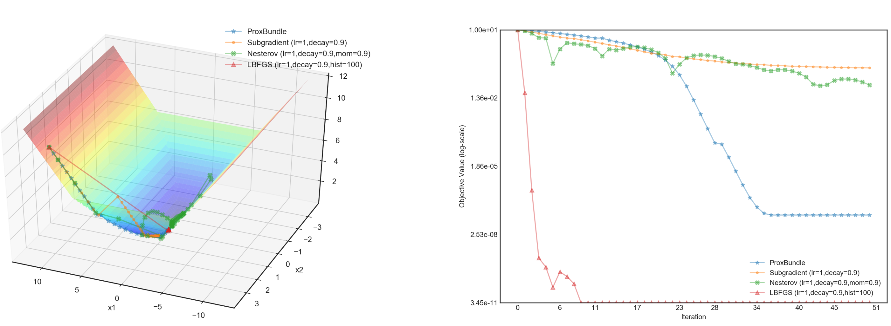

# autoNSO
Simple implementations of common non-smooth optimization (NSO) methods using PyTorch auto-differentiation as the subgradient oracle.  

Research in non-smooth optimization often assume that one does not "see" the explicit form of the objective function. Instead, one can only evaluate the function at certain points as well as obtain one subgradient in the subdifferential of the function at that point ("make oracle calls"). Under that setting, autoNSO is designed for comparing and benchmarking the convergence rates and step-wise optimization paths of common NSO algorithms on an arbitrary objective function. This code is unlike most NSO code in that one **does not need to define the subgradient oracle**; instead, the subgradient is calculated automatically using PyTorch **autodifferentiation**.

Currently, the software is capable of the following methods:

* Prox-Bundle
* Subgradient Descent
* Nesterov Accelerated Subgradient Descent
* L-BFGS

Defining new optimization algorithms for one's own use is easy: just modify the code in `algs/optAlg.py`.

Quick examples are in the  `simple_examples`  folder. For instance, the following two plots are only generated by 10 lines! (See `simple_examples/plot_multiple.py` for a better formatted version.) 

```
def simple2D(x):
    return torch.max(torch.abs(x[0]),0.5 * x[1]**2)
Simple2D = Objective(simple2D)
optAlg1 = ProxBundle(Simple2D, x0=[10,3], max_iter=50); optAlg1.optimize()
optAlg2 = Subgradient(Simple2D, x0=[10,3], max_iter=50); optAlg2.optimize()
optAlg3 = Nesterov(Simple2D, x0=[10,3], max_iter=50); optAlg3.optimize()
optAlg4 = LBFGS(Simple2D, x0=[10,3], max_iter=50); optAlg4.optimize()
opt_plot = OptPlot(opt_algs=[optAlg1, optAlg2, optAlg3, optAlg4])
opt_plot.plotPath()
opt_plot.plotValue()
```


 

Maintainer:   X.Y. Han, Cornell University ORIE\
Contact:      xiaoyanhn@gmail.com

Please cite:

> X.Y. Han, *autoNSO: Implementations of Common NSO Methods with Auto-differentiation*, (2019), GitHub repository, https://github.com/xiaoyanh/autoNSO

```
@misc{Han2019,
  author = {Han, X.Y.},
  title = {autoNSO: Implementations of Common NSO Methods with Auto-differentiation},
  year = {2019},
  publisher = {GitHub},
  journal = {GitHub repository},
  howpublished = {\url{https://github.com/xiaoyanh/autoNSO}},
  commit = {<ADD COMMIT ID HERE>}
}
```

Disclaimer: This code is essentially a wrapper between PyTorch, CVXPY, and Matplotlib to do benchmarking for NSO research. It is not implemented to be the fastest possible in terms of wall-clock time.
